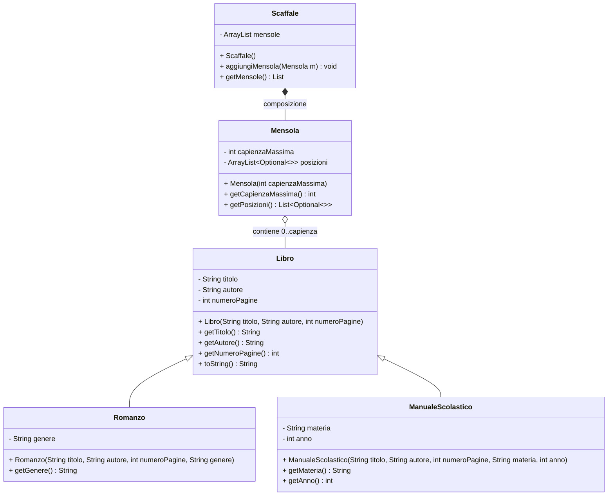

# Diagramma di Classe UML — La Biblioteca Dinamica

Note:
- La composizione Scaffale–Mensola indica che le mensole sono parte integrante dello scaffale.
- `Mensola.posizioni` è modellata come `ArrayList<Optional<Libro>>` per rappresentare posizioni fisse che possono essere vuote (`Optional.empty()`).
